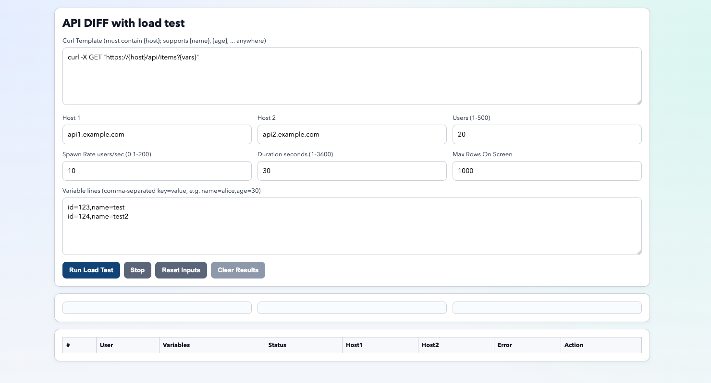

# Curl Comparator Load Test

Locust-style load testing and response comparison tool built with Flask and `curl`.

## Features

- Compare the same request against two hosts (`{host}` placeholder).
- Use custom variables like `{name}`, `{age}` in URL, headers, or body.
- Ramp virtual users with configurable spawn rate and duration.
- Live SSE streaming of results and metrics.
- Per-row JSON diff popup.
- Uses real `curl` timing metrics (`time_total`, `time_starttransfer`).



## Install

```bash
pip install .
```

Or from source requirements:

```bash
pip install -r requirements.txt
```

## Run

### Development

```bash
curl-compare-loadtest
```

### Production (Gunicorn)

```bash
gunicorn -w 4 -k gthread -b 0.0.0.0:8000 app:app
```

Open: `http://localhost:8000`

## Template Variables

- Required: `{host}`
- Optional: any token from variable lines, for example:
  - Template: `curl -H "X-User: {name}" "https://{host}/v1?age={age}"`
  - Variables line: `name=alice,age=30`
- Backward compatible: `{vars}` maps to the raw line string.

## Build Package

```bash
python -m build
```

This produces wheel and source distribution in `dist/`.

## License

MIT. See `LICENSE`.
